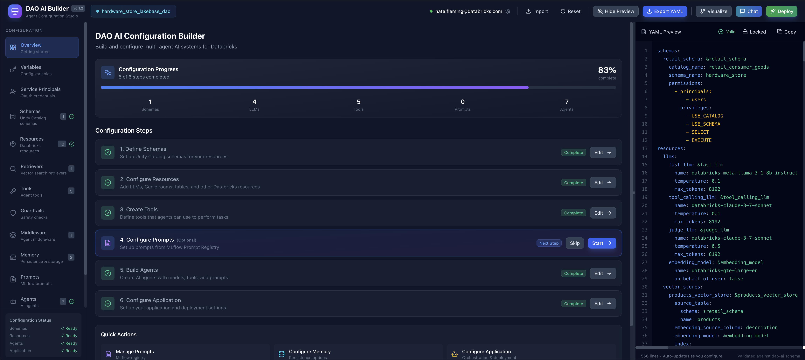

# DAO AI Builder

> A visual configuration studio for building AI agent systems on Databricks



DAO AI Builder is a web application that helps you create and configure multi-agent AI systems without writing YAML by hand. It provides a modern, intuitive interface with real-time preview of your configuration.

---

## Table of Contents

- [What is DAO AI Builder?](#what-is-dao-ai-builder)
- [Features](#features)
- [Getting Started](#getting-started)
  - [Prerequisites](#prerequisites)
  - [Local Development](#local-development)
- [Deploying to Databricks](#deploying-to-databricks)
- [Using the Application](#using-the-application)
- [Configuration Sections](#configuration-sections)
- [Architecture](#architecture)
- [Troubleshooting](#troubleshooting)
- [License](#license)

---

## What is DAO AI Builder?

DAO AI Builder is a visual configuration tool for [dao-ai](https://github.com/databricks/dao-ai), Databricks' framework for building AI agent systems. Instead of manually writing complex YAML configuration files, you can:

- **Point and click** to configure agents, tools, and resources
- **See real-time preview** of your YAML as you make changes
- **Import existing configurations** to edit them visually
- **Export valid YAML** ready for deployment

Think of it as a "form builder" for AI agent configurations.

---

## Features

### 🎨 Visual Configuration
- Modern dark-themed interface
- Split-panel layout with live YAML preview
- Form-based configuration (no YAML knowledge required)
- Real-time validation

### 🤖 AI-Powered Assistance
- **AI Assistant** for generating system prompts
- **Prompt improvement** suggestions
- Optimized for GenAI agent applications

### 🔗 Databricks Integration
- Automatic discovery of Unity Catalog assets (catalogs, schemas, tables, functions)
- Browse and select SQL warehouses, Genie rooms, and Vector Search indexes
- Connect to model serving endpoints
- Works with on-behalf-of-user authentication

### 📦 Complete Agent Configuration
- Schemas, LLMs, Tools, Guardrails, Agents
- Memory and persistence options
- MLflow prompt registry integration
- Multi-agent orchestration (Supervisor & Swarm patterns)

---

## Getting Started

### Prerequisites

Before you begin, make sure you have:

| Requirement | Version | Check Command |
|-------------|---------|---------------|
| Node.js | 18 or higher | `node --version` |
| Python | 3.10 or higher | `python --version` |
| Databricks CLI | Latest | `databricks --version` |

### Local Development

Follow these steps to run DAO AI Builder on your computer:

#### Step 1: Clone the Repository

```bash
git clone <repository-url>
cd dao-ui
```

#### Step 2: Set Up Environment Variables

Create a `.env` file in the project root:

```bash
# .env
DATABRICKS_HOST=https://your-workspace.cloud.databricks.com
DATABRICKS_TOKEN=dapi...your-token...
```

> 💡 **Tip:** You can get a personal access token from your Databricks workspace under **User Settings → Developer → Access Tokens**

#### Step 3: Build the Frontend

```bash
cd frontend
npm install
npm run build
cd ..
```

#### Step 4: Copy Frontend to Static Folder

```bash
rm -rf static
cp -r frontend/dist static
```

#### Step 5: Install Python Dependencies

```bash
pip install -r requirements.txt
```

#### Step 6: Run the Application

```bash
python app.py
```

#### Step 7: Open in Browser

Go to [http://localhost:8080](http://localhost:8080)

🎉 You should see the DAO AI Builder interface!

---

## Deploying to Databricks

DAO AI Builder is designed to run as a **Databricks App**. This gives you:
- Automatic authentication with your workspace
- Access to Unity Catalog and other Databricks services
- Secure hosting within your Databricks environment

### Option 1: Using Databricks Asset Bundles (Recommended)

This is the simplest deployment method:

```bash
# 1. Build the frontend
cd frontend && npm install && npm run build && cd ..
cp -r frontend/dist static

# 2. Deploy using bundles
databricks bundle deploy -t default
```

The app will be available at: `https://<workspace>/apps/dao-ai-builder`

### Option 2: Using the Deploy Script

```bash
./deploy.sh dao-ai-builder
```

This script handles building, uploading, and deploying automatically.

### Option 3: Manual Deployment

<details>
<summary>Click to expand manual deployment steps</summary>

1. **Build the frontend:**
   ```bash
   cd frontend
   npm install
   npm run build
   cd ..
   rm -rf static
   cp -r frontend/dist static
   ```

2. **Upload to your workspace:**
   ```bash
   databricks workspace mkdirs /Workspace/Users/YOUR_EMAIL/apps/dao-ai-builder
   databricks sync . /Workspace/Users/YOUR_EMAIL/apps/dao-ai-builder --watch=false
   ```

3. **Create or update the app:**
   ```bash
   # Create new app
   databricks apps create dao-ai-builder \
     --source-code-path /Workspace/Users/YOUR_EMAIL/apps/dao-ai-builder

   # Or update existing app
   databricks apps deploy dao-ai-builder \
     --source-code-path /Workspace/Users/YOUR_EMAIL/apps/dao-ai-builder
   ```

</details>

---

## Using the Application

### Overview Page

When you first open the app, you'll see the **Overview** page showing:
- Your configuration progress
- Quick access to different sections
- Configuration status indicators

### Basic Workflow

1. **Define Schemas** - Set up Unity Catalog schemas for your resources
2. **Configure Resources** - Add Genie rooms, SQL warehouses, Vector Search, etc.
3. **Create Tools** - Define tools that agents can use
4. **Build Agents** - Configure AI agents with models, tools, and prompts
5. **Configure Application** - Set up deployment settings

### Importing Existing Configuration

Click the **Import** button in the top-right corner to load an existing YAML file.

### Exporting Your Configuration

Click **Export YAML** to download your configuration, or use **Copy** to copy it to your clipboard.

---

## Configuration Sections

| Section | Description |
|---------|-------------|
| **Variables** | Define reusable variables (environment vars, secrets, values) |
| **Schemas** | Unity Catalog schema references |
| **Resources** | Databricks resources (Genie, SQL, Vector Search, Tables, Functions, etc.) |
| **Retrievers** | Vector search retriever configurations |
| **Tools** | Agent tools (Factory, Python, Unity Catalog, MCP) |
| **Guardrails** | Safety checks and content filters |
| **Memory** | Persistence and storage options |
| **Prompts** | MLflow prompt registry integration |
| **Agents** | AI agent configurations |
| **Application** | Deployment and orchestration settings |

---

## Architecture

```
┌─────────────────────────────────────────────────────────┐
│                    Your Browser                          │
│  ┌─────────────────────────────────────────────────┐    │
│  │              React Frontend                      │    │
│  │  • Configuration forms                          │    │
│  │  • Live YAML preview                            │    │
│  │  • Databricks asset browser                     │    │
│  └──────────────────────┬──────────────────────────┘    │
└─────────────────────────┼───────────────────────────────┘
                          │ API calls
                          ▼
┌─────────────────────────────────────────────────────────┐
│                  Flask Backend (app.py)                  │
│  • Serves the web interface                             │
│  • Proxies requests to Databricks APIs                  │
│  • Handles authentication                               │
│  • AI prompt generation via Claude                      │
└─────────────────────────┬───────────────────────────────┘
                          │
                          ▼
┌─────────────────────────────────────────────────────────┐
│                  Databricks Workspace                    │
│  • Unity Catalog (catalogs, schemas, tables, functions) │
│  • SQL Warehouses                                       │
│  • Genie Rooms                                          │
│  • Vector Search                                        │
│  • Model Serving Endpoints                              │
└─────────────────────────────────────────────────────────┘
```

### Project Structure

```
dao-ui/
├── app.py                # Flask backend
├── app.yaml              # Databricks App runtime config
├── databricks.yml        # Asset bundle configuration
├── requirements.txt      # Python dependencies
├── deploy.sh             # Deployment script
├── static/               # Built frontend (generated)
├── frontend/             # React source code
│   ├── src/
│   │   ├── components/   # UI components
│   │   ├── hooks/        # React hooks (Databricks API)
│   │   ├── stores/       # State management (Zustand)
│   │   └── types/        # TypeScript definitions
│   └── package.json
├── schemas/              # JSON schemas for validation
└── docs/                 # Documentation and images
```

---

## Troubleshooting

### "Authentication required" error

**Cause:** The app can't connect to Databricks.

**Solution:**
- For local development: Make sure your `.env` file has valid `DATABRICKS_HOST` and `DATABRICKS_TOKEN`
- For Databricks Apps: Check that user_api_scopes are properly configured in `databricks.yml`

### Dropdowns are empty (no catalogs/schemas showing)

**Cause:** The user doesn't have access to Unity Catalog or the connection failed.

**Solution:**
1. Check that you have access to Unity Catalog in your workspace
2. Try refreshing the page
3. Check the browser console for error messages

### YAML preview shows errors

**Cause:** Invalid configuration values.

**Solution:**
- Look for red indicators in the configuration sections
- Hover over fields to see validation hints
- Make sure required fields are filled in

### "Failed to generate prompt" (AI Assistant)

**Cause:** The AI assistant can't reach the model serving endpoint.

**Solution:**
- Ensure the `databricks-claude-sonnet-4` endpoint is available in your workspace
- Check that the app has `serving.serving-endpoints` scope

### Changes not appearing after deployment

**Solution:**
1. Hard refresh your browser (Cmd+Shift+R on Mac, Ctrl+Shift+R on Windows)
2. Clear browser cache
3. Redeploy the app with `databricks apps deploy`

---

## Tech Stack

| Component | Technology |
|-----------|------------|
| Frontend | React 18, TypeScript, Vite, Tailwind CSS |
| State | Zustand |
| Backend | Flask, Gunicorn |
| Icons | Lucide React |
| YAML | js-yaml |

---

## Environment Variables

| Variable | Description | When Needed |
|----------|-------------|-------------|
| `DATABRICKS_HOST` | Workspace URL (e.g., `https://xxx.cloud.databricks.com`) | Local development |
| `DATABRICKS_TOKEN` | Personal access token | Local development |
| `PORT` | Server port (default: 8080 local, 8000 deployed) | Optional |
| `DEBUG` | Enable debug mode | Optional |

---

## License

MIT

---

<p align="center">
  <sub>Built with ❤️ for the Databricks community</sub>
</p>
