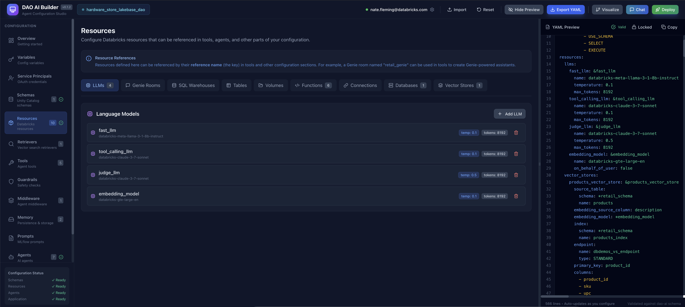
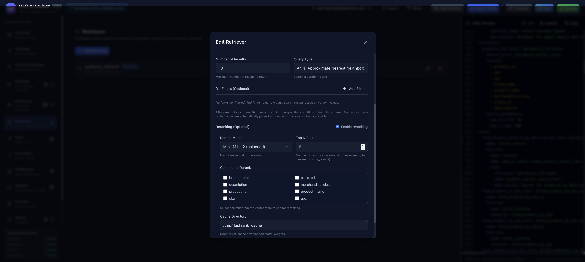
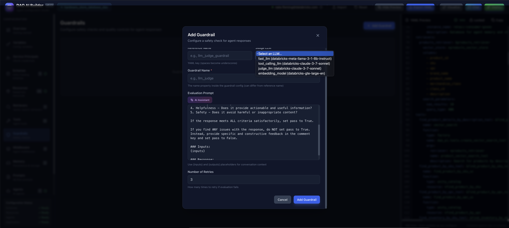
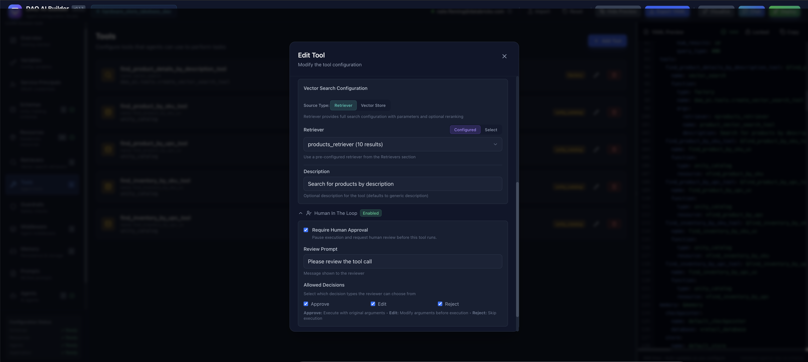
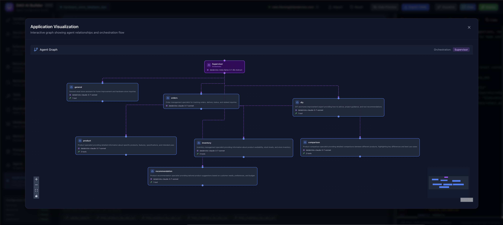
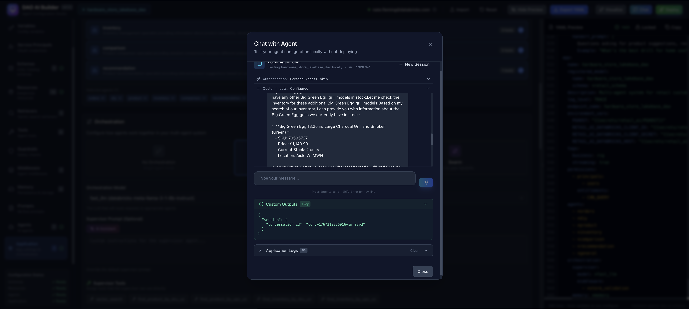
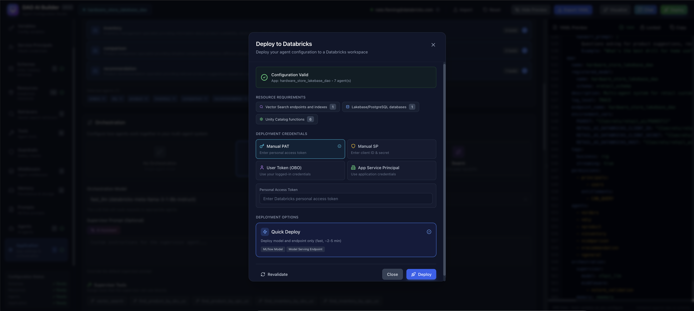

# DAO AI Builder

> Build AI agents visually — no YAML required


**DAO AI Builder** is a visual interface for creating AI agent configurations. Instead of writing YAML by hand, you use forms and dropdowns to configure agents, connect to your data, and export ready-to-deploy configurations.

This is the **companion tool** for [DAO AI](https://github.com/databricks/dao-ai), Databricks' framework for building and deploying AI agents.

---

## Quick Start

### Prerequisites

Before you begin, you'll need:

- **Databricks workspace access** with Unity Catalog enabled
- **Databricks CLI** installed and authenticated
- **Node.js** (version 18 or higher)
- **npm** (comes with Node.js)

To check if you're ready:

```bash
databricks --version         # Should show a version number
databricks current-user me   # Should show your Databricks username
node --version               # Should show v18.x.x or higher
npm --version                # Should show a version number
```

### Deploy to Databricks

The easiest way to use DAO AI Builder is to deploy it as a Databricks App:

```bash
# Clone the repository
git clone https://github.com/natefleming/dao-ai-builder.git
cd dao-ai-builder

# Deploy (builds frontend, syncs files, starts the app)
./deploy.sh
```

**Deploying to different workspaces:**

```bash
# Deploy to a specific workspace using a profile
./deploy.sh --profile aws-field-eng

# Deploy to Azure workspace
./deploy.sh -p azure-retail

# Clean deployment to a specific workspace
./deploy.sh --force --profile aws-prod
```

That's it! The script will:
1. Build the frontend
2. Upload files to your Databricks workspace
3. Create and start the app
4. Display the URL when ready

**First deployment takes 3-5 minutes.** Subsequent deployments are faster.

### Access Your App

After deployment, the script displays your app URL:

```
App URL: https://your-workspace.cloud.databricks.com/apps/dao-ai-builder
```

Click the link or copy it to your browser. You'll be automatically authenticated with your Databricks account.

---

## Features

### Connect to Your Data

Browse and connect to Databricks resources directly from the UI. Select catalogs, schemas, Genie spaces, SQL warehouses, and Vector Search indexes without typing names manually.



### Configure Agents

Build AI agents with models, tools, prompts, and guardrails. The form-based interface guides you through each option.


### Set Up Retrievers

Configure vector search retrievers for RAG (Retrieval-Augmented Generation) applications.



### Add Guardrails

Define safety checks and content filters to ensure appropriate agent responses.



### Human-in-the-Loop

Configure human approval workflows for sensitive agent actions.



### Visualize Your Configuration

See how agents, tools, and resources connect in an interactive graph view.



### Chat with Your Agent

Test your agent configuration with the built-in chat interface.



### Deploy from the UI

Deploy your agent directly to Databricks Model Serving.



---

## How It Relates to DAO AI

**DAO AI Builder** creates configuration files. **[DAO AI](https://github.com/databricks/dao-ai)** deploys them.

```
DAO AI Builder (this tool)        DAO AI Framework
┌────────────────────┐           ┌────────────────────┐
│  Visual interface  │           │  Deployment engine │
│  Point and click   │ ───────►  │  Provisions agents │
│  Export YAML       │  config   │  Runs on Databricks│
└────────────────────┘   file    └────────────────────┘
```

**Workflow:**
1. Design your agent in DAO AI Builder
2. Export the YAML configuration
3. Deploy with DAO AI: `dao deploy my-agent.yaml`

**Learn more:** [github.com/databricks/dao-ai](https://github.com/databricks/dao-ai)

---

## Deployment Options

### Option 1: Deploy Script (Recommended)

```bash
./deploy.sh
```

**Available options:**

| Option | Description |
|--------|-------------|
| `-h, --help` | Show help message |
| `-p, --profile PROFILE` | Use a specific Databricks CLI profile |
| `--force` | Clean deployment (removes cached artifacts) |

**Examples:**

```bash
# Deploy to default workspace
./deploy.sh

# Deploy to AWS workspace
./deploy.sh --profile aws-field-eng

# Deploy to Azure workspace
./deploy.sh -p azure-retail

# Clean deployment to a specific workspace
./deploy.sh --force --profile aws-prod
```

### Option 2: Manual Deployment

If you prefer to run the steps yourself:

```bash
# Build frontend
cd frontend
npm install
npm run build
cd ..

# Copy to static folder
rm -rf static
cp -r frontend/dist static

# Deploy using Databricks bundle (with optional profile)
databricks --profile my-profile bundle deploy

# Deploy the app
databricks --profile my-profile apps deploy dao-ai-builder --source-code-path <your-workspace-path>
```

---

## Redeploying

After making changes, redeploy with:

```bash
./deploy.sh
```

To see the app status:

```bash
databricks apps get dao-ai-builder
```

To stop the app:

```bash
databricks apps stop dao-ai-builder
```

---

## Troubleshooting

### "Databricks CLI not found"

Install the Databricks CLI:

```bash
pip install databricks-cli
databricks configure
```

### "Databricks CLI not authenticated"

Run:

```bash
databricks configure
```

Or use OAuth:

```bash
databricks auth login --host https://your-workspace.cloud.databricks.com
```

### "npm not found"

Install Node.js from https://nodejs.org (choose the LTS version).

### Deployment times out

The app may still be starting. Check status:

```bash
databricks apps get dao-ai-builder
```

Wait a minute and try accessing the URL again.

### Need a clean deployment

Remove cached files and redeploy:

```bash
./deploy.sh --force
```

### App shows old version

1. Redeploy: `./deploy.sh`
2. Hard refresh your browser (Cmd+Shift+R or Ctrl+Shift+R)

---

## Configuration Sections

| Section | Purpose |
|---------|---------|
| **Variables** | Reusable values (API keys, settings) |
| **Schemas** | Unity Catalog locations for your data |
| **Resources** | Data sources (Genie, SQL, Vector Search) |
| **Tools** | Actions agents can perform |
| **Guardrails** | Safety checks for responses |
| **Memory** | Conversation storage |
| **Agents** | AI agents with models and prompts |
| **Application** | Deployment settings |

---

## Useful Commands

```bash
# Deploy or redeploy (default workspace)
./deploy.sh

# Deploy to a specific workspace
./deploy.sh --profile aws-field-eng

# Clean deployment (removes cached files)
./deploy.sh --force

# Clean deployment to a specific workspace
./deploy.sh --force --profile azure-retail

# Check app status
databricks apps get dao-ai-builder

# Check app status on a specific workspace
databricks --profile aws-field-eng apps get dao-ai-builder

# View deployment history
databricks apps list-deployments dao-ai-builder

# Stop the app
databricks apps stop dao-ai-builder

# Start the app
databricks apps start dao-ai-builder
```

---

## Related Links

- **DAO AI Framework:** [github.com/databricks/dao-ai](https://github.com/databricks/dao-ai)
- **DAO AI Documentation:** [docs](https://github.com/databricks/dao-ai/tree/main/docs)
- **Example Configurations:** [examples](https://github.com/databricks/dao-ai/tree/main/config/examples)
- **Databricks Apps:** [docs.databricks.com](https://docs.databricks.com/dev-tools/databricks-apps/)

---

## License

MIT

---

<p align="center">
  Part of the <a href="https://github.com/databricks/dao-ai">DAO AI</a> ecosystem
</p>
